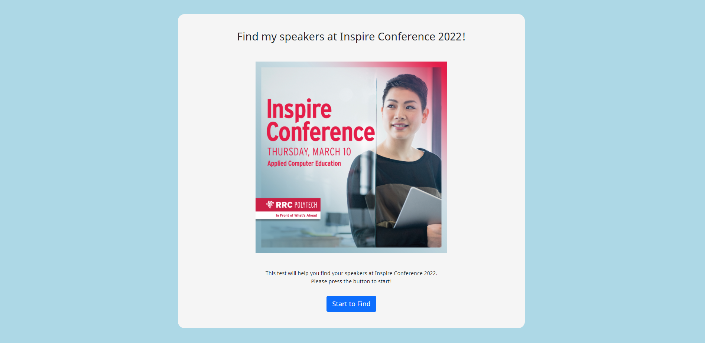
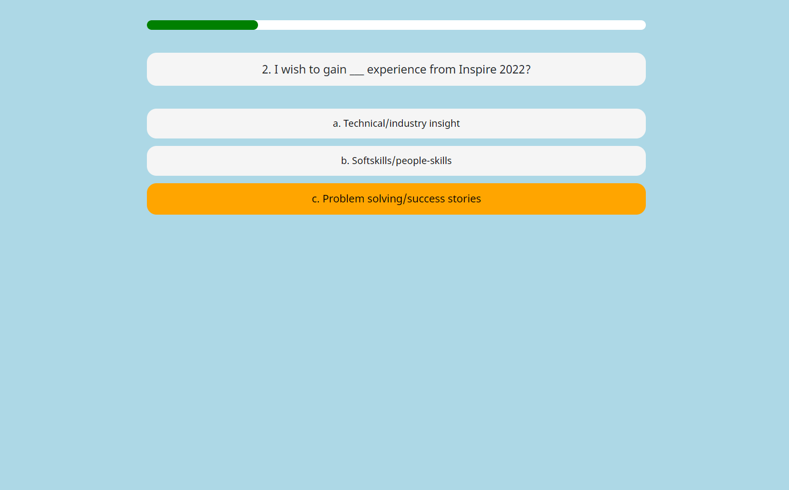
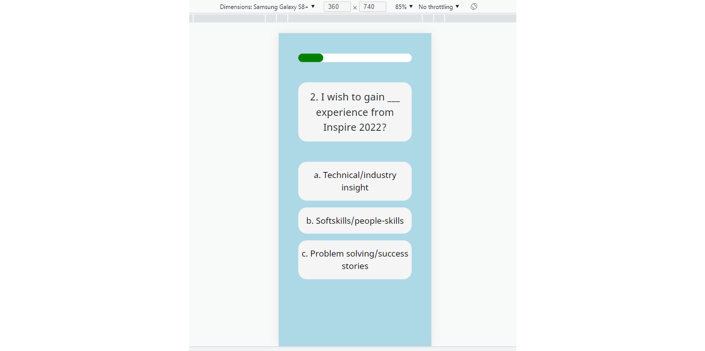
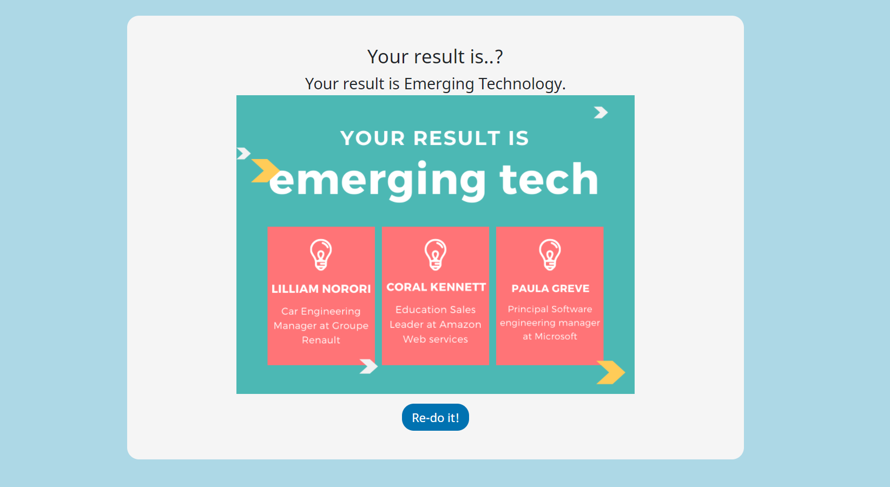
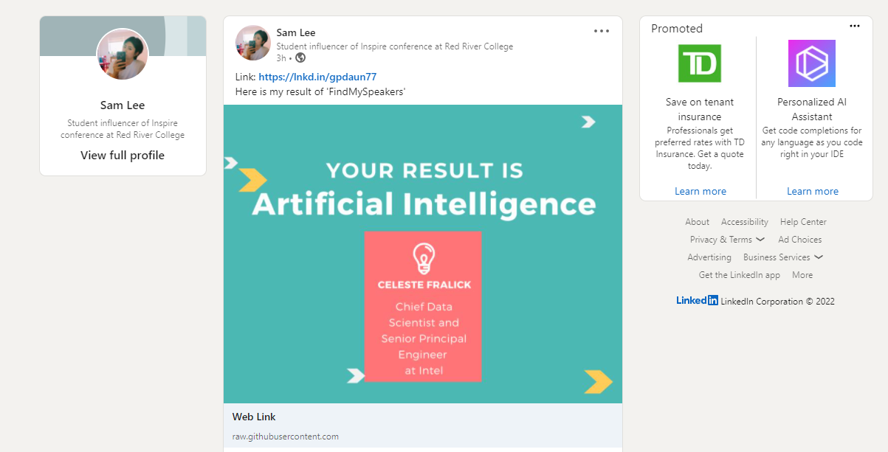

# FindMySpeakers
> This repository is a test program for finding suitable speakers for students at Inspire Conference 2022. 
>
> Test Link: https://findmyspeakers.netlify.app
> 
> Reference Link: https://inf.run/Kucb (in Korean)
> 
## Contents
* html
* css
* js

## Overview
| Start page |  
|---------------------|
|  |

| Question and selectable answers with status bar | Mobile version (responsive) |
|---------------------|---------------------|
| | |

| Result page |  LinkedIn share  |
|---------------------|---------------------|
| | |

<!-- CONTACT -->
## Contact

Sam Lee - [@LinkedIn](https://www.linkedin.com/in/sam-lee-dev/) - LeeSam235711@gmail.com

(<a href="#top">back to top</a>)

