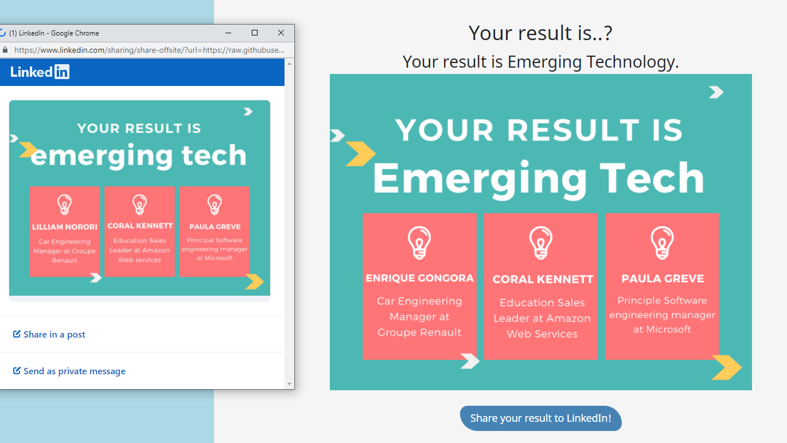

# FindMySpeakers
> 
> This repository is a test program for finding suitable speakers for students at Inspire Conference 2022. 
>
> Reference Link: https://inf.run/Kucb (in Korean)

## Contents
* HTML
* CSS
* Javacript

## How to use

1. Click the link below (no need sign up)

   Link: https://findmyspeakers.netlify.app

2. Choose the best answer of each question

3. Share your result on your linkedIn account

## What I've learned
1. How to export the result page to social media (Thanks for @DZ-FSDev)
2. Make sure check the data accuracy
- Had an issue of result page image
- Replaced the correct image to Netlify but it wouldn't be updated the result page of LinkedIn
- It took a week for matching the two sites

| Two different results between Netlify and LinkedIn |  
|---------------------|
|  |

## Overview
| Start page |  
|---------------------|
|  |

| Question and selectable answers with status bar | Mobile version (responsive) |
|---------------------|---------------------|
| | |

| Result page | 
|---------------------|
| |

| Export test result to LinkedIn   |
|---------------------|
| |

<!-- CONTACT -->
## Contact

Sam Lee - [@LinkedIn](https://www.linkedin.com/in/sam-lee-dev/) - LeeSam235711@gmail.com

(<a href="#top">back to top</a>)

